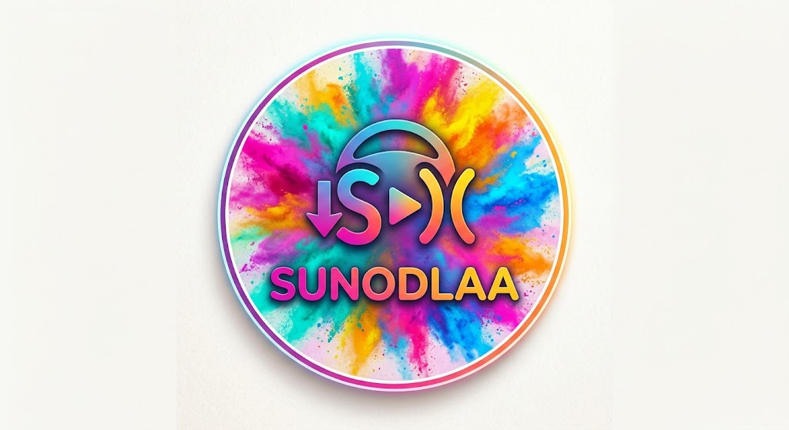

<p align="center">
  
</p>

<h3 align="center">Your Suno songs. Downloaded, organized, and in your car.</h3>

<p align="center">
  <b>SUNODLAA</b> = <b>Suno</b> · <b>D</b>own<b>L</b>oad · <b>A</b>ndroid <b>A</b>uto<br>
  A Windows desktop tool + an Android / Android Auto player, built to work together.
</p>

---

## Why this exists

I make a lot of music on Suno. Hundreds of tracks, split across workspaces — one per project,
one per album idea, one per person I write for. And the official experience is painful:

- **The Suno app can't browse your workspaces.** Your library is one endless, laggy scroll.
  The structure you carefully built on the website simply doesn't exist on your phone.
- **Getting your own songs out is a clicking marathon.** One track, one menu, one download,
  one file named whatever Suno feels like. Repeat a few hundred times. At the end you still
  have a flat folder of files with no order, no album, no cover, no way to tell covers from originals.
- **Nothing for the car.** No Android Auto, no way to play a workspace start to finish while driving.

These are **my** songs. I shouldn't need an afternoon of clicks to get them, and I should be able
to organize them the way *I* want.

So I built SUNODLAA.

## What you get

### 💻 SunoAAWeb (desktop) — your library, in bulk, in order
A small local web app (double-click to start, nothing to install):

- **Browse every workspace** with its tracks, covers and dates.
- **See what you already have**: ✅ on disk · 🫥 missing. One click queues everything missing.
- **Download in bulk** into **one folder per workspace**, with a naming pattern *you* choose
  (default `Suno - {workspace}` → `Suno - Lucie`).
- **File names your way, like MediaMonkey's mask**: `<Disc#>-<Track#> <Title>` →
  `01-054 EuroDemo 'Slow Techno'.mp3` (French tags such as `<Piste n°>` work too). Track numbers
  follow the workspace's creation order, so a track downloaded later keeps its number.
- **MP3 or WAV**: MP3 is Suno's own quality (≈180 kbps VBR, 48 kHz — there is no 128/320 choice on
  Suno's side); WAV is lossless and available on Suno Pro plans.
- **Re-organize what you already have**: one click renames existing workspace folders to your
  format (e.g. `Suno -Lucie` → `Suno - Lucie`), with a preview, never overwriting an existing folder.
- **Proper ID3 tags on every file**: title, artist, album (= workspace), cover art, lyrics,
  year, and the **Suno track ID** (in `TSRC`) so the file stays linked to Suno forever.
- **Originals highlighted in gold** and pinned first — covers are grouped under the song they come from.
- **Synced lyrics as `.lrc`** next to each song when Suno has the timings (karaoke in MediaMonkey and most players),
  plus a built-in player with live lyrics.
- **Guided first run**: a 3-step setup — sign in (a login window opens, you sign in, done: no token or cookie
  to hunt for), pick your folder with the normal Windows folder picker, pick a naming style with a live preview.
- **One big button: “Download everything missing”** across all workspaces, with progress, a stop button,
  a clear list of what failed and why, and a pause between downloads so Suno doesn't block you.
  Stop any time — the next run picks up where it left off.
- **English or French**, chosen in Settings and remembered.

### 📱 Android & Android Auto — listen your way
- **Workspaces first**: open a workspace, play it. Or browse **All tracks** (by date or A→Z),
  **Favorites** (synced with Suno), **Offline**, **Recent**, **Playlists**.
- **Plays the files you own** from any folder (local, pCloud, Drive…), matched to Suno by
  their `TSRC` ID — the same ID the desktop writes.
- **Android Auto**: the same library on your car screen. Tracks you don't have yet are shown
  but never break playback.
- Lyrics and full track info on the player screen, gold originals, fast local search.
- **English or French**, chosen in Settings (and on the welcome screen), independent of the phone's language.

**The loop:** the desktop fills your library, neatly organized → the phone and the car play it.

## Quick start

Two launchers sit at the root of the repository:

| Launcher | What it does |
|---|---|
| **`Launch SunoAAWeb.bat`** | Starts the desktop web app and opens it in your browser. |
| **`Launch Android Drive Unit Test.bat`** | Tests Android Auto **on your PC**: installs Google's Desktop Head Unit if needed, connects your phone over USB and opens the car screen. |

### SunoAAWeb (Windows)
1. Download this repository (Code → Download ZIP) and unzip it.
2. Double-click **`Launch SunoAAWeb.bat`**. Your browser opens on `http://localhost:8787`.
3. Follow the 3-step setup (language at the top): **Connect to Suno** → **Choose a folder** → **naming style**.
4. **Download everything missing** — or open a workspace and download just that one, or tick tracks.

Requirements: Windows 10/11 with Edge or Chrome. PowerShell and the tagging library are built in / bundled.

### Android
1. Install [`releases/SUNODLAA-v0.16.2.apk`](releases/) (allow unknown sources).
2. Sign in to Suno, then pick the folder that holds your MP3s (the one the desktop fills).
3. **Android Auto without the Play Store**: Android Auto → Settings → tap *Version* 10× →
   ⋮ → Developer settings → enable **Unknown sources**.

### Test Android Auto on your PC
Run **`Launch Android Drive Unit Test.bat`** — **no Android Studio needed**:
- it uses the `adb` you already have (Minimal ADB, Android SDK, or anything on your PATH),
  and can fetch Google's latest one if yours is too old;
- on first run it downloads Google's official **Desktop Head Unit** (≈7 MB, checksum-verified)
  into `%LOCALAPPDATA%\SUNODLAA\dhu`, after asking you.

The launcher asks which car screen to simulate: **Mazda MX-5 2024+ (8.8" widescreen, 1280×480)**
by default, a classic 7" 800×480, or a large Full HD screen — so the image is sharp instead of an
enlarged 800×480.

On the phone, once:
1. Android Auto → Settings → tap *Version* 10× to unlock developer mode.
2. Top-right menu → **Start head unit server**.
3. Enable USB debugging and plug the phone in.

Then pick **SUNODLAA** on the emulated car screen.

## Free vs Pro — the honest part

Suno protects its streams. SUNODLAA does **not** try to get around that.

- **Downloading** uses Suno's own download link for each track, so it works when your account
  is allowed to download (Pro/Premier, or tracks you own). Otherwise the track stays 🫥 and the
  reason is shown.
- **Playback** uses **your files**. If you already have your MP3s (exported earlier, synced from
  the cloud…), everything works on any plan: point the app at the folder and it matches them.

## Repository layout

```
Launch SunoAAWeb.bat                 Start the desktop web app
Launch Android Drive Unit Test.bat   Test Android Auto on the PC (Desktop Head Unit)
desktop/    SunoAAWeb: server.ps1 (PowerShell), index.html, lib/TagLibSharp.dll
android/    Android Studio project (Kotlin, Jetpack Compose, Media3, Room) — EN + FR
releases/   Ready-to-install APK
```

## Build the Android app

Open `android/` in Android Studio (JDK 17) → Run, or:

```
cd android
./gradlew :app:assembleDebug
```

## Under the hood
- Auth: Suno signs in through Clerk. SUNODLAA keeps the `__client` session cookie locally and
  exchanges it for short-lived tokens, like the website does.
- Desktop: PowerShell `HttpListener` serves the page and proxies the API calls; TagLib-Sharp writes the tags.
- Android: Media3 `MediaLibraryService` (phone + Android Auto), Room cache, WorkManager sync.
- Everything stays on your machine. No server, no account, no telemetry.

## Disclaimer
SUNODLAA is an independent, unofficial project for personal use. It is not affiliated with or
endorsed by Suno. It uses the same web endpoints as the Suno website, which may change at any time.
Only download music you have the right to download.

---

<p align="center">Made by <b>Soaresden</b> · <a href="https://github.com/soaresden/SunoDLAA">github.com/soaresden/SunoDLAA</a></p>
