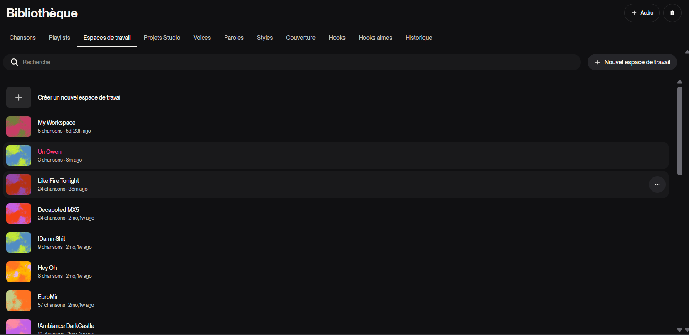
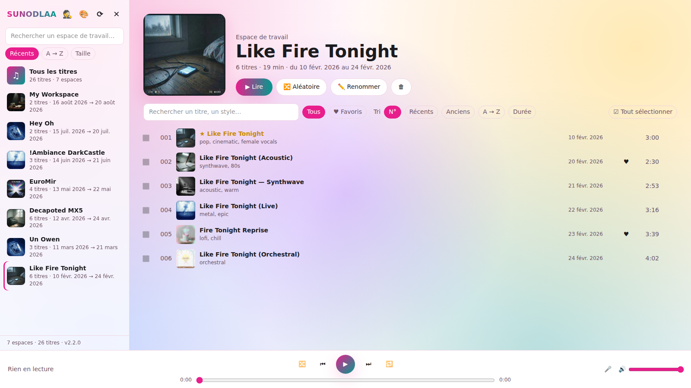
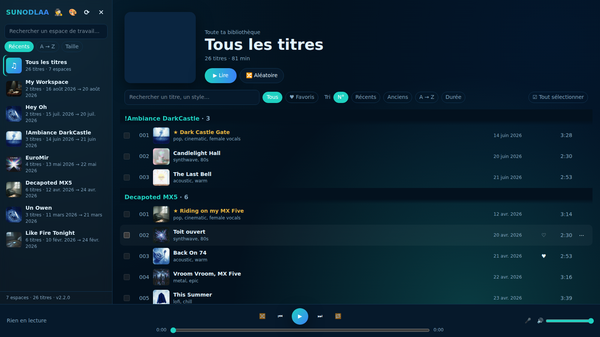
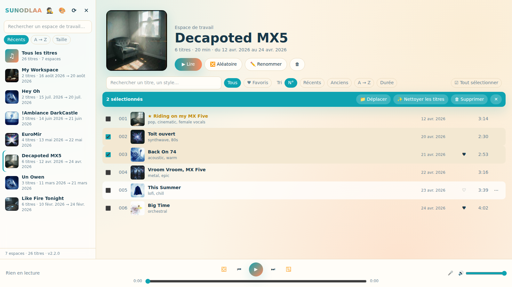
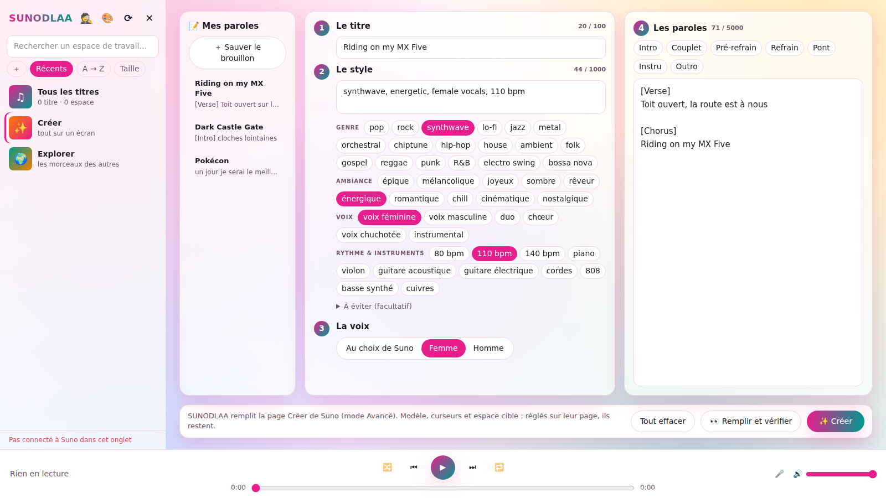
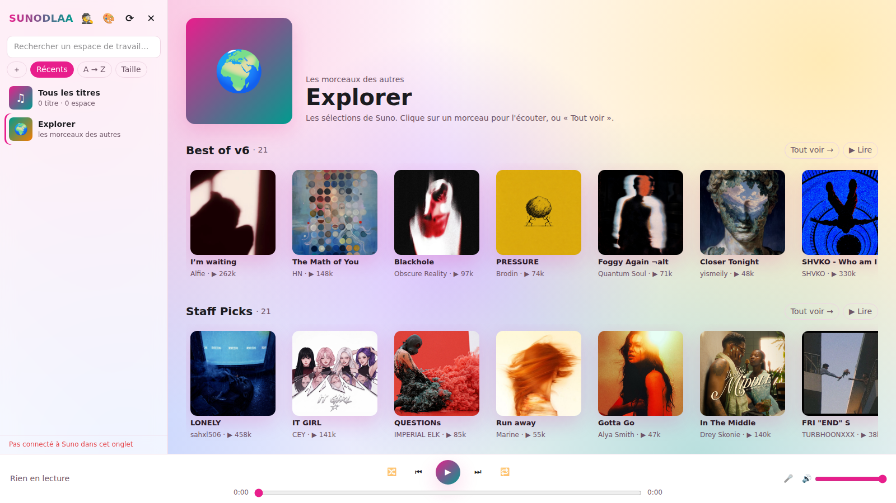
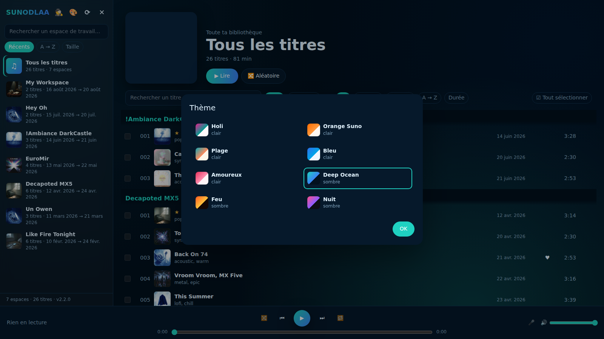
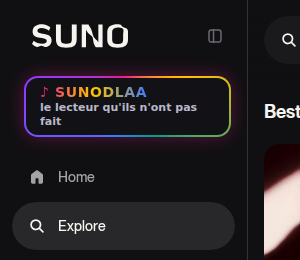

<p align="center">
  
</p>

<h3 align="center">Your Suno library, by workspace. On suno.com, on your phone, in your car.</h3>

<p align="center">
  <b>SUNODLAA</b> started as <b>Suno</b> · <b>D</b>own<b>L</b>oad · <b>A</b>ndroid <b>A</b>uto.<br>
  The "download" part didn't survive. Here is why, and what it became.
</p>

---

## The story

I make a lot of music on Suno: more than 1,500 tracks, sorted into 200+ workspaces. One per
project, one per album idea, one per person I write for.

The official apps never respected that structure:

- **No workspaces on the phone.** Two years later, the Suno app still can't play a workspace. Your
  library is one endless scroll.
- **Nothing workable in the car.** Android Auto shows a flat list, not your projects.
- **The website is a chore** for anything in bulk: renaming, cleaning titles, moving tracks around.

So the original plan was simple: **download my whole library once**, cleanly organized (one folder
per workspace, proper names, tags, covers, lyrics), keep it on my cloud drive, and build an
Android / Android Auto player around those files. That's what this repository did: a desktop
downloader (SunoAAWeb) plus the Android app.

### Then Suno changed the rules

On **September 3, 2026**, Suno capped downloads, **including songs made before that date**:

| Plan | Downloads |
|---|---|
| Free | 7, for life |
| Pro | 20 per month |
| Premier | 60 per month |

Listening stays unlimited, but only inside Suno. Getting your own songs out became a monthly
ration: at 20 a month, my library would take about **six years** of Pro to export. I upgraded to Pro
specifically to "re-download everything cleanly"... a few days after the cap landed.

Frustrating? Very. These are my songs. But it's their platform and their rules, and this project
does **not** work around them: no decryption, no stream ripping, no download tricks.

So the downloader is gone, and SUNODLAA became what it should have been from the start:
**the player Suno never built.**

## Before / after

**Before: suno.com's library.** A flat list of workspace names. Opening one means scrolling through a feed.

<p align="center"></p>

**After: the same library with SUNODLAA, on suno.com itself.** Workspaces with covers and dates,
numbered tracks (original ★ first), play / shuffle, actions, themes.

<p align="center"></p>

<p align="center">
  
  
</p>

<p align="center"></p>

<p align="center"></p>

<p align="center">
  
  
</p>

## What SUNODLAA is now

### 🌐 SUNODLAA for suno.com (a bookmark)
One click on a bookmark, and a new interface opens **on top of suno.com**, in your own tab, with
your own session. A glowing **♪ SUNODLAA** button even sits right under Suno's logo.

- **Your workspaces first**, with covers and dates (first → last track), sorted by recent, A → Z or size.
- **All tracks** view, grouped by workspace. Search by title or style, ♥ favorites.
- **✨ Create on one screen**: title, style built from clickable tags, voice, lyrics with
  [Verse]/[Chorus] buttons, your Suno saved lyrics as drafts. It fills Suno's own Create page and
  presses its button.
- **🌍 Explore other people's songs**: Suno's public selections as cover carousels, any public
  playlist in full, play them in a row.
- Tracks numbered **original first** (★), then oldest → newest. Sort by number, date, title, length.
- **Play a whole workspace**, shuffle, repeat. Lyrics with **word-by-word karaoke**, full screen.
- **Manage your library live on Suno**: rename (with a clean-title suggestion), move to another
  workspace, delete, like; create a workspace; select many tracks at once; rename / delete a workspace;
  ✨ clean all messy titles of a workspace in one go.
- **8 themes**: Holi, Orange Suno, Plage, Bleu, Amoureux, Deep Ocean, Feu, Nuit. Your choice is
  saved in the browser.
- **Playback is Suno's own player.** The overlay opens the song in the page and presses Play.
  It never touches the audio.
- **English or French**, following your computer's language.

### 📱 Android & Android Auto
- **Workspaces first**, on the phone and on the car screen: open a workspace, play it.
- **Every track plays.** Tracks without a file are played by **Suno's own web player**, running
  invisibly inside the app with your session (network needed; the app only says play / pause / seek).
- **Optional: your own files.** If you already have MP3s (pCloud, Drive, the phone), link the folder:
  those tracks play from the file, offline, with a play cache for tunnels. Icons show where each
  track comes from: ☁ folder · 📱 phone · ⚡ cache.
- Lyrics, favorites synced with Suno, search, playlists, recent.
- **Same 8 themes** as the bookmark.
- English or French.

## Install

### The bookmark
1. Open **`SUNODLAA - Installer le favori.html`** (at the root of this repository) in your browser.
2. Show the bookmarks bar (`Ctrl+Shift+B`) and **drag the ♪ SUNODLAA button onto it**.
3. Go to **suno.com** (signed in) and click the bookmark. Click it again, or press `Esc`, to hide it.

To update: open the installer again and drag the new button (replace the old bookmark).

### Android
1. Install the latest APK from [`releases/`](releases/) (allow unknown sources).
2. Sign in to Suno. Linking a music folder is optional.
3. **Android Auto without the Play Store**: Android Auto → Settings → tap *Version* 10× →
   ⋮ → Developer settings → enable **Unknown sources**.

### Test Android Auto on your PC
Run **`Launch Android Drive Unit Test.bat`**. No Android Studio needed: it uses your `adb` and
downloads Google's official Desktop Head Unit on first run (after asking). Screen presets include the
Mazda MX-5 (1280×480). On the phone, once: Android Auto → Settings → tap *Version* 10× → menu →
**Start head unit server**, enable USB debugging, plug in.

## The rules we keep
- Only what suno.com itself does, with your own session: the same calls for listing, renaming,
  moving, deleting, liking.
- Audio is always played by Suno's player (or from your own files). Nothing is decrypted, copied or downloaded.
- Nothing leaves your machine: no server, no account, no telemetry.

## Repository layout
```
SUNODLAA - Installer le favori.html   Bookmark installer (drag & drop)
suno-plus/      The bookmark's source (suno-plus.js), themes.json, build scripts
android/        Android Studio project (Kotlin, Jetpack Compose, Media3, Room)
releases/       Ready-to-install APK
Launch Android Drive Unit Test.bat    Android Auto on the PC
```

## Build
- **Bookmark**: `python suno-plus/build.py` rebuilds the installer from `suno-plus.js` and `themes.json`.
- **Themes**: edit `suno-plus/themes.json`, then `python suno-plus/gen_android_themes.py android/app/src/main/java/com/soaresden/sunoauto/ui/theme/Themes.kt` so the phone gets the same ones.
- **Android**: open `android/` in Android Studio (JDK 17), or `cd android && ./gradlew :app:assembleDebug`.

## Disclaimer
SUNODLAA is an independent, unofficial project for personal use. It is not affiliated with or
endorsed by Suno. It relies on how suno.com works today, which may change at any time.
